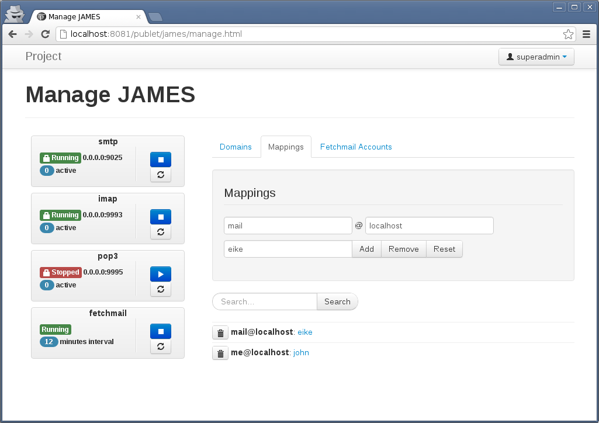
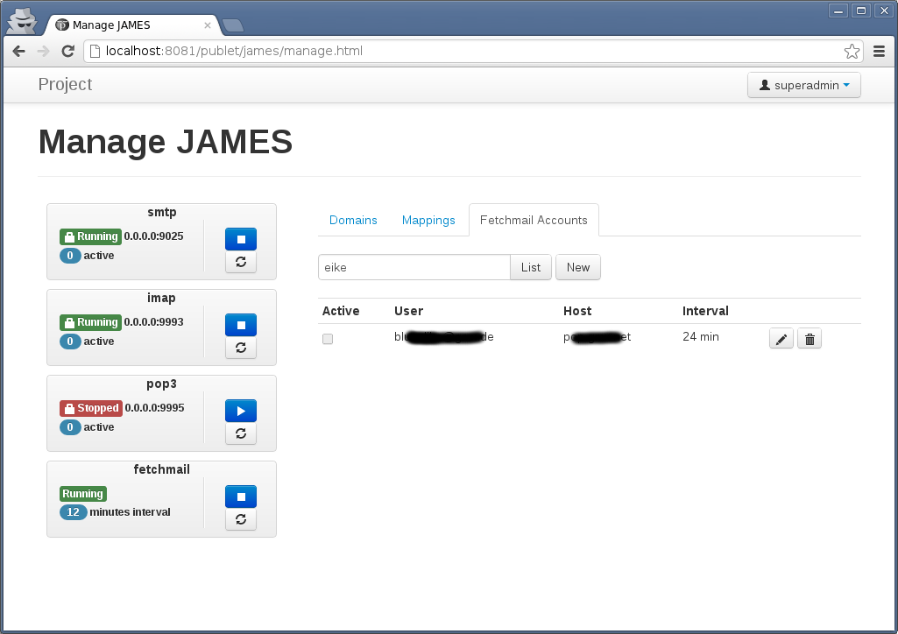
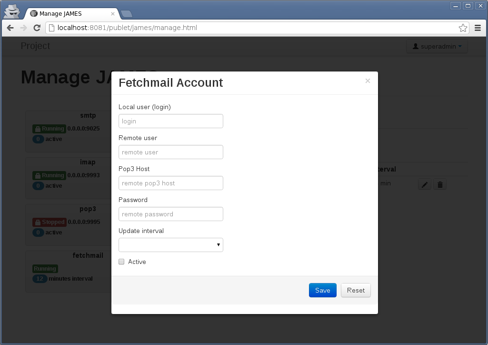
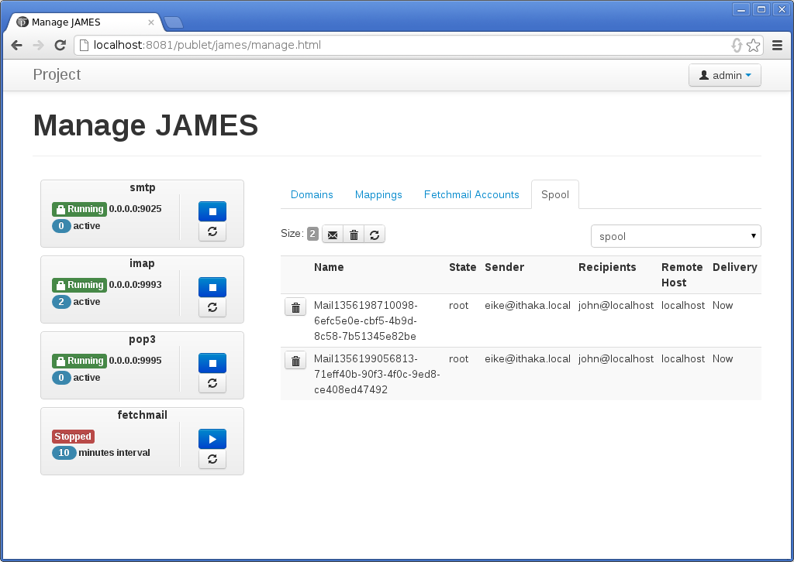
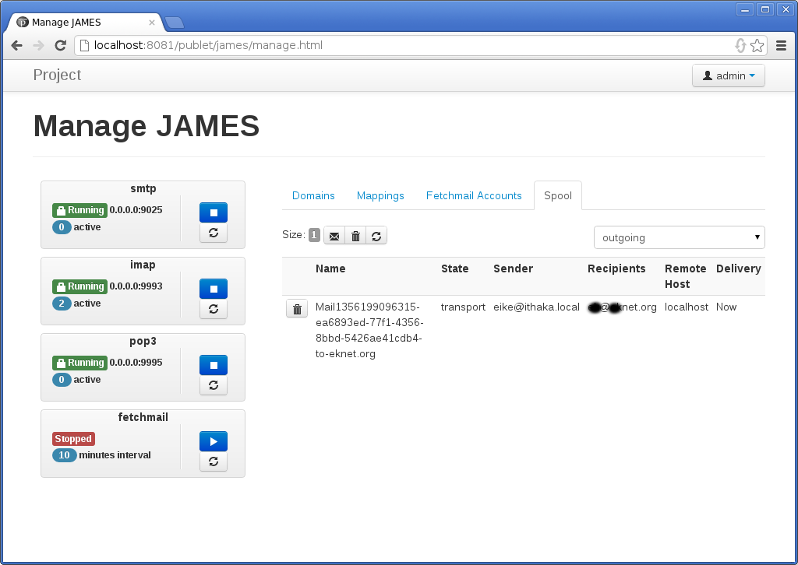
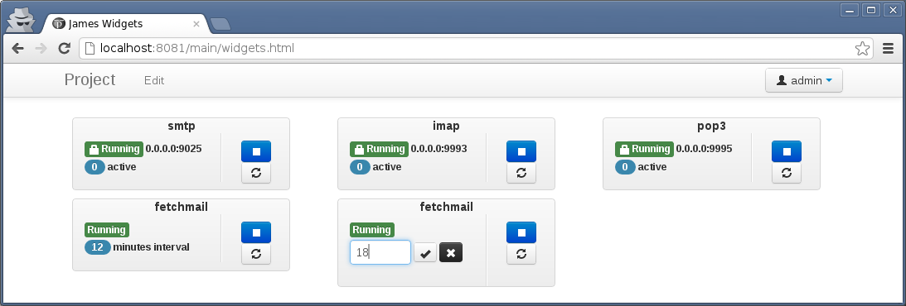

## James Extension

This extension adds [Apache James](http://james.apache.org) to publet,
turning it into a feature-rich email server. A web interface is provided to
manage the server and you can easily hook into the mail processing chain.

Required Extensions

* Webeditor
* Extra
* Publet Quartz

### Configuration

There are 3 server threads started by default providing the following services

1. SMTP, bound to `0.0.0.0`, port `9025` (StartTLS)
2. IMAPv4, bound to `0.0.0.0`, port `9993` (SSL)
3. POP3, bound to `0.0.0.0`, port `9995` (SSL)
4. Fetchmail. See the documentation below.

By default, all services are configured to run over SSL (imap and pop3) or
use StartTLS (smtp). The certificate is looked up from the keystore `etc/keystore.ks`
and if that does not exist, a default self-signed certificate is created. The
ports are the standard ports with an offset of `9000`, because on linux systems
users other than root are not allowed to bind ports below `1024`. The tool `iptables`
or something similiar can be used to forward traffic from the standard ports to those.

#### Users

The james extension uses the user service provided by publet. Every user that
is added to the group `mailgroup` is allowed to connect to the mail servers
using his password. The james server(s) do only see users belonging to this
group, all others are not visible to James. Thus, to be able to send/receive
mails or browse the mailboxes, add your users to the `mailgroup`.

#### Default Configuration Files

This extension provides default configuration for james that aims to be as
sensible as possible. These are the templates provided by James with only
slight modifications. The configuration is provided by the following files:

* [domainlist.conf](domainlist.html)
* [imapserver.conf](imapserver.html)
* [smtpserver.conf](smtpserver.html)
* [pop3server.conf](pop3server.html)
* [mailetcontainer.conf](mailetcontainer.html)

If any such file is placed in the `etc/` directory, the default file is
discarded.

James resources specified in the configuration files are mapped to publet's
file system structure. Resources `file://conf/x.y` are mapped to `etc/x.y`
and `file://var/x.y` are mapped to `$PUBLET_CONFIG/james/var`.

If you just want to change certain default properties (like for example the
keystore password) then you can add those to publet's configuration file
`publet.properties` instead of creating complete new xml files. The keys
must be prefixed with `publet.james.conf.`. Each james default config value
is replaced with an existing value in `publet.properties`.

So to change the keystore password for the provided servers, add it
as follows:

    publet.james.conf.smtpserver.tls.secret=mysuperword123
    publet.james.conf.imapserver.tls.secret=mysuperword123
    publet.james.conf.pop3server.tls.secret=mysuperword123

This way any default value can be replaced, though it's not possible to
remove or add values.

### Fetchmail

A fetchmail background job can be used to fetch external mail and deliver it to
local accounts.

#### James Fetchmail Scheduler

James provides a `FetchScheduler` that can be configured by xml files. You need
to create a configuration file `etc/fetchmail.conf`. Please see
[James Documentation](http://james.apache.org/server/3/config-fetchmail.html) for
how to configure it.

James' fetchmail scheduler can be configured in various ways and is very powerful. Many
options should be carefully set by an admin user.

#### Integrated Scheduler

This extension provides another fetchmail scheduler that can be configured via the
web interface. It aims to be more easy to use, but lacks some of the features compared
to James' "native" scheduler.

The configuration is divided into two parts: First, regular user can manage their accounts
via the web. All those account are processed by one job that is executed repeatedly. The
admin user can edit the interval of this job, as well as starting or stopping it. The user
can configure for each of his accounts, at which multiple of the run it should be processed.
For example, on every run or on every second run etc.

Secondly, instead of configuring the maximum number of threads to use, you can configure
how many accounts should be processed sequentially by one thread. The fetchmail job is
collecting this number of accounts and schedules a fetch-job for each pile. You can configure
this number in publets' configuration file:

    james.fetchmail.jobsize=10

The default value is 10. So if there are 100 accounts, there can be up to ten threads
(depending on your thread-pool configuration) running concurrently fetching mails. This
feature relys on the [Quartz Scheduler](http://quartz-scheduler.org/) library, meaning
the [publet-quartz extension](../publetquartzmodule/) must be available. So you can still
configure the thread pool using `quartz.properties` configuration file. Please see the
[publet-quartz extension](../publetquartzmodule/) for how to do that.

### Custom Mailets

It is very easy to hook into the mail processing chain with Apache James. This is done
by implementing a `Mailet` and configuring it in `mailetcontainer.conf` configuration file.

This extension provides a mailet (it is active for all mails by default) that will forward any
mail to publet's event bus. Thus, to hook into the mail processing chain, just add a
singleton to your guice module and `@Subscribe` to the `IncomeMailEvent`. The `IncomeMailEvent`
object holds a reference to the mail and the `MailetConfig` such that subscribers can
alter the mail like a normal `Mailet`. This forwarding mailet is added to the standard
transport processor and gets notified for every mail that is locally or remotely delivered
by James.

If you provide a custom `mailetcontainer.conf` file in the `etc/` directory, you might
want to enable this feature via:

    <!-- publet mailet that posts mails on the global event bus -->
    <mailet match="All" class="org.eknet.publet.james.mailets.EventBusMailet"/>

Mailets declared in the `mailetcontainer.conf` file are instantiated using Guice. That
means the dependencies of each mailet (and matcher) are automatically injected.

For example, you can now add scala classes to the `startup` folder and subscribe to
`IncomeMailEvent`s to react on any incoming mails without touching any code. All
that is needed is an appropriate scala class in `/main/.allIncludes/startup/` folder.

#### SimpleMailingListHeaders

Using the recipient rewrite table feature of James, you can easily forward mails to one
address to many recipients. This can be used to create simple small mailing lists,
since mails are delivered to remote and local recipients. The mailet `SimpleMailingListHeaders`
now can add the appropriate headers to such mails.

If you have declared such a mailing list mapping in the virtual address table, just add
the address to your `settings.properties`:

    james.mailing-lists=mylist@mydomain.com

Any mail to this address is now enhanced with some more headers identifying this mail
as a mailing list mail.

## Manage

The mail servers can be managed via a provided web interface. There are two templates

* `/publet/james/manage.html` and
* `/publet/james/mailsettings.html`

The first one is intended for the admin users as it exposes all available settings. The
second one includes a widget for managing aliases for the current user and his fetchmail
accounts.

If you look at the source of the templates (just use the extension `page`), you'll see that
all widgets are provided by JQuery plugins. That makes it very easy to create your own
page and rearrange or drop widgets as you desire.

If you put the widgets in other pages, you might have to adjust the url to the json
servlets. You also need to include the asset group `publet.james` in your page.

### Permissions

The action of every widget is protected by permissions. The following lists all
permissions.

#### Alias

The permissions are per login. That means getting all aliases of a login, adding
or removing aliasses for a specific login:

    def removeAlias(login:String) = "james:alias:remove:"+login
    def addAlias(login:String) = "james:alias:add:"+login
    def getAlias(login:String) = "james:alias:get:"+login

Aliases are just mappings that are restricted to the account of a local user. This
does only work for the currently logged in user. By editing the mappings directly,
you can specify any mapping you want.

#### Domains

The following shows the permissions used when adding/removing domains. Getting
the list of domains is possible for any james user (every user belonging to the
`mailgroup`).

    def addDomain(domain:String) = "james:domain:add:"+domain
    def removeDomain(domain:String) = "james:domain:remove:"+domain

#### Fetchmail

Getting information of a fetchmail account is permitted per login. You need
to give every user explicit permission if you want him to edit his accounts
himself.

    def getFetchmailAccount(login: String) = "james:fetchmail:account:get:"+login
    def removeFetchmailAccount(login: String) = "james:fetchmail:account:delete:"+login
    def addFetchmailAccount(login: String) = "james:fetchmail:account:add:"+login

The fetchmail scheduler can be started and stopped. Also the interval can be set
and the information about the scheduler can be retrieved.

    val getFetchmailScheduler = "james:fetchmail:scheduler:get"
    val startFetchmailScheduler = "james:fetchmail:scheduler:start"
    val stopFetchmailScheduler = "james:fetchmail:scheduler:stop"
    val setFetchmailScheduler = "james:fetchmail:scheduler:set"

#### Mappings

The powerful concept of recipient rewriting is restricted to users with the following
permissions:

    val getMappings = "james:mappings:get"
    val addMappings = "james:mappings:add"
    val removeMappings = "james:mappings:remove"

#### Servers

The mail server threads can be started and stopped. Additionally information about
the current state can be retrieved.

    def getServer(stype: String) = "james:server:get:"+stype
    def stopServer(stype: String) = "james:server:stop:"+stype
    def startServer(stype: String) = "james:server:start:"+stype

### Web Interface

The following give a quick view of the two management sites available. In general, every
submission is immediately applying to the services. For example, as soon as you remove a
domain, the mail server does not accept mails with this domain anymore.

#### Domains

Managing domains is not much. You can add and remove domains.

#### Mappings

Managing mappings is quite similiar. You define the mapping using the first two text fields
that receive the username and domain part separately. Both can be left empty in which case the
wildcard `*` is applied. The target can be a local username or an email address. If you click
on a target, the form is filled with that information and you can edit the entry.

<ul class="thumbnails">
<li class="span4"></li>
</ul>

In the screenshot above, all mails to `me@localhost` are forwarded to the local account `john`,
while all mails to `mail@localhost` is forwarded to the local account `eike`.

#### Fetchmail Accounts

The widget allows to manage fetchmail accounts, which can be configured for the current user
only, or for an admin user. The following screenshot shows the interface for the admin user:

<ul class="thumbnails">
<li class="span4"></li>
<li class="span4"></li>
</ul>

The admin can edit all fetchmail accounts. The search form can be used to type in a specific
login name to list all acounts for a given user.

When editing accounts, the passwords are never shown and the password field can be left empty. In
that case it is not touched. If adding a new account, a password is required, of course.

In "current user mode", the widget just hides the search form (it would work, but only results
for the current user are listed). In the update and add form, the "Local user" field is hidden, since
the user is already known.

#### Mail Queues

The mail queues are holding incoming and outgoing messages that are not yet processed by james.
The _spooler manager_ widget can be used to view the queues and do some basic maintenance tasks,
like clearing the queue or individual items or flushing the queue. When a queue is "flushed", all
items are made available to james for immediate processing.

The two queues can be selected on the right, use `spool` for incoming and `outgoing` for outgoing
(non local) messages.

<ul class="thumbnails">
<li class="span4"></li>
<li class="span4"></li>
</ul>

#### Servers

The next screenshot shows four widgets already seen on the other screenshots in isolation (the last
one is included twice) showing the state for each server. The widget allows to start/stop the service
and shows some information, like the number of current connections and whether it is running in secured
mode or not. If not running by either using ssl sockets or starttls, the lock is not shown. The address
and port, the service is bound to are show in the middle (not for the fetchmail thread of course).

<ul class="thumbnails">
<li class="span8"></li>
</ul>

The fetchmail widget has another feature: A click on the interval label will turn it into
a small input field, that allows you to change fetchmail interval.

The screenshot above was created by a this `page` template:

    ---
    title: James Widgets
    assetGroups: publet.james

    --- name:head pipeline:jade
    :javascript
      $(function() {
        $('.smtpWidget').serverManager({actionUrl: "/publet/james/action/manageserver.json"});
        $('.imapWidget').serverManager({serverType: "imap", actionUrl: "/publet/james/action/manageserver.json"});
        $('.pop3Widget').serverManager({serverType: "pop3", actionUrl: "/publet/james/action/manageserver.json"});
        $('.fetchmailWidget').fetchmailSchedulerManager({actionUrl: "/publet/james/action/managefetchmailscheduler.json"});
      });

    --- name:content pipeline:jade

    br/
    .row
      .span4
        .smtpWidget
      .span4
        .imapWidget
      .span4
        .pop3Widget
    .row
      .span4
        .fetchmailWidget
      .span4
        .fetchmailWidget
